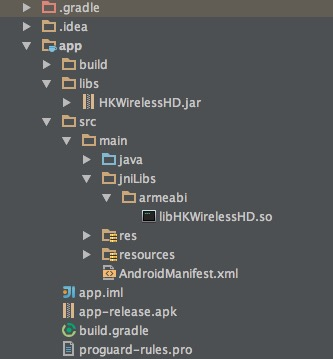
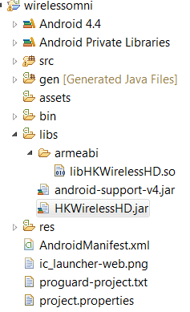

Getting Started Guide (Android)
===============================

The Harman/Kardon WirelessHD SDK is provided for Android 3rd party developers to communicate with Harman/Kardon Omni Series audio/video devices. The intent of this SDK is to provide the tools and libraries necessary to build, test and deploy the latest audio applications on the Android platform.

Project Setup with HKWirelessHDSDK
-----------------------------------------------------------

Requirements
~~~~~~~~~~~~~~~~~~~~~~~~~~~~~~~~~~~~~~~~~~~~~

The HKWirelessHD SDK requires Android 4.1(API 16) minimum for Android devices. The SDK supports both 32bit and 64bit architecture.

Add Jar package and library in your project
~~~~~~~~~~~~~~~~~~~~~~~~~~~~~~~~~~~~~~~~~~~~~

Add the libHKWirelessHD.jar package and libHKWirelessHD.so library in your libs folder.

In Android Studio
Add the HKWirelessHD.jar to libs folder and add the libHKWirelessHD.so to jniLibs/armeabi folder. 

File->Project Structor->Modules->Dependencies, push +，then File dependency，select HKWirelessHD.jar.

Then add the jar package as library.

The directory hierarchy as following:

In Eclipse: Add the HKWirelessHD.jar to libs folder and add the libHKWirelessHD.so to libs/armeabi folder. 

Project property->Java Build Path->Libraries select “Add External JARs”，choose the HKWirelessHD.jar.

Then add the jar package as external JARs.

The directory hierarchy as following:

Add Permission in AndroidManifest.xml file
~~~~~~~~~~~~~~~~~~~~~~~~~~~~~~~~~~~~~~~~~~~

.. code-block:: java

	<uses-permission android:name="android.permission.INTERNET" />
	<uses-permission android:name="android.permission.ACCESS_WIFI_STATE"/>

Import package and implement interface
~~~~~~~~~~~~~~~~~~~~~~~~~~~~~~~~~~~~~~~

Add the package header to your code:

.. code-block:: java

	import com.harman.hkwirelessapi.*

Implement the interface like this:

.. code-block:: java

	public class YourClass implements HKWirelessListener {

	}

The interfaces should be implemented:

.. code-block:: java

	public void onDeviceStateUpdated(long deviceId, int reason){

	}
	public void onPlaybackStateChanged(int playState){

	}
	public void onVolumeLevelChanged(long deviceId, int deviceVolume, int avgVolume){

	}
	public void onPlayEnded(){

	}
	public void onPlaybackTimeChanged(int timeElapsed){

	}
	public void onErrorOccurred(int errorCode, String errorMesg){

	}

Creating a Sample Application
--------------------------------

All APIs can be accessed through the object pointer of HKWirelessHandler and AudioCodecHandler. Only you have to do is create a HKWirelessHandler object and  a AudioCodecHandler object use them to invoke the APIs you want to use.

Create HKWirelessHD Control Handler and initialize the Wireless Audio
~~~~~~~~~~~~~~~~~~~~~~~~~~~~~~~~~~~~~~~~~~~~~~~~~~~~~~~~~~~~~~~~~~~~~

.. code-block:: java

	// Create a HKWControlHandler instance
	HKWirelessHandler hControlHandler = new HKWirelessHandler();

	// Initialize the HKWControlHandler and start wireless audio
	hControlHandler.initializeHKWirelessController("");

Note 
	``InitializeHKWirelessController()`` is a blocking call. It waits until the call successfully initializes the wireless audio network. If the phone device does not belong to a Wi-Fi network or not have network permission or if other HKWirelessHD app is running on the same device, then it will keep blocked. It would be nice to present a dialog to user before calling ``initializeHKWirelessController()`` to notice that the app will wait until HWWirelessHD network is available. 

Discovery and refreshing of available speakers in the Wi-Fi network
~~~~~~~~~~~~~~~~~~~~~~~~~~~~~~~~~~~~~~~~~~~~~~~~~~~~~~~~~~~~~~~~~~~~~

The status of speakers can be changed dynamically over time. And, whenever a speaker is turned off or on, the list of speakers available in the network should be refreshed. Especially, when you select speakers for playback, the speaker list and the status of each speaker should be updated with the latest information.

To discover and update the status of speakers, you need to refresh the status regularly. The SDK provides a pair of convenient APIs to refresh device status.

To check the status of devices in the network,

.. code-block:: java

	// start to refresh devices ... 
	hControlHandler.startRefreshDeviceInfo()

	// stop to refresh devices
	hControlHandler.stopRefreshDeviceInfo()  
	
``startRefreshDeviceInfo()`` will refresh and update every 2 seconds the status of the devices in the current Wi-Fi network.

Speakers and Groups
~~~~~~~~~~~~~~~~~~~~~~~~~~~~~~~~~~~~~~~~~~~~~~~~~~~~~~~~~~~~~~~~~~~~~

There are two ways to choose speakers to play on – one is point at a speaker from the global list of speakers maintained by the internal data structure, and the other is point at a speaker with a group (or room) index and the index of the speaker within the group. Note that in this document, the term group and room are used as the same meaning, that is, a set of speakers.

Selecting a speaker individually
^^^^^^^^^^^^^^^^^^^^^^^^^^^^^^^^^^^^^^^

Selecting a speaker individually
Point at a speaker in the global list

.. code-block:: java

	// get the number of available speakers
	int deviceCount = hControlHandler.getDeviceCount()

	// get the info of the first devices in the list
	var index = 0
	DeviceObj deviceInfo = hControlHandler.getDeviceInfoByIndex(index)

Retrieve DeviceInfo with deviceId
If you know the deviceId of a speaker, then you can retrieve the device information using findDeviceFromList().

.. code-block:: java

	// get the number of available speakers
	long deviceId = ""
	DeviceObj deviceInfo = hControlHandler.findDeviceFromList(deviceId)

Selecting a speaker from a group

A ‘Group’ is defined by the group info of each speaker. That is, if a speaker has a group information that it belongs to, then the group have the speaker as a member. So, if speaker A and speaker B have the same group info of Group C (e.g. group name), then Group C will have speaker A and speaker B as members. If speaker A changes the group name as ‘Group D’, then Group C will have only speaker B, and Group D will have speaker A as a member.
Get the number of groups available in the network

.. code-block:: java

	// get the number of groups
	int groupCount = hControlHandler.getGroupCount()

Get the number of devices in a group
	
.. code-block:: java
	
	// get the number of devices in the first group 
	int groupIndex = 0
	int deviceCount = hControlHandler.getDeviceCountInGroupIndex(groupIndex)
	
Retrieve the information of a device
You can retrieve the information of a device (speaker) using DeviceInfo object. Please refer to DeviceInfo.h. The following is the list of information that DeviceInfo provides:

As shown in the table above, some of the attributes can be set by APIs. And some attributes change over time, so the app should have the latest value of the attributes by calling corresponding APIs or by callback functions.

The following is an example of retrieving some of attributes of a speaker information.

.. code-block:: java

       DeviceObj DeviceInfo = hControlHandler.getDeviceInfoFromTable(groupIndex, deviceIndex);
        Log.d(LOG_TAG, "name :" + DeviceInfo.deviceName);
        Log.d(LOG_TAG, "ipAddress :" + DeviceInfo.ipAddress);
        Log.d(LOG_TAG, "volume :" + DeviceInfo.volume);
        Log.d(LOG_TAG, "port :" + DeviceInfo.port);
        Log.d(LOG_TAG, "role :" + DeviceInfo.role);
        Log.d(LOG_TAG, "modelName :" + DeviceInfo.modelName);
        Log.d(LOG_TAG, "zoneName :" + DeviceInfo.zoneName);
        Log.d(LOG_TAG, "active :" + DeviceInfo.active);
        Log.d(LOG_TAG, "version :" + DeviceInfo.version);
        Log.d(LOG_TAG, "wifi :" + DeviceInfo.wifiSignalStrength);
        Log.d(LOG_TAG, "groupID :" + DeviceInfo.groupId);
        Log.d(LOG_TAG, "balance :" + DeviceInfo.balance);
        Log.d(LOG_TAG, "isPlaying :" + DeviceInfo.isPlaying);
        Log.d(LOG_TAG, "channelType :" + DeviceInfo.channelType);
        Log.d(LOG_TAG, "isMaster :" + DeviceInfo.isMaster);

Change speaker name and group name
~~~~~~~~~~~~~~~~~~~~~~~~~~~~~~~~~~~~

Change speaker name
^^^^^^^^^^^^^^^^^^^^^

Use ``setDeviceName()`` to change the speaker name. Note that you cannot set the device name by setting “deviceName” property value directly. The property is read-only.

.. code-block:: java

	hControlHandler.setDeviceName(deviceId, "My Omni10")

Change speaker’s group (room) name
^^^^^^^^^^^^^^^^^^^^^^^^^^^^^^^^^^^^

Use ``setDeviceGroupName()`` to change the group (or room) name of a speaker. Note that you cannot set the group name by setting “groupName” property value directly. The property is read-only.

.. code-block:: java

	hControlHandler.setDeviceGroupName(deviceId, "Living Room")

Note that, if you change the group name of a speaker, then the list of devices of the groups automatically changes.

Remove a speaker from a group (room)
^^^^^^^^^^^^^^^^^^^^^^^^^^^^^^^^^^^^^^

Use removeDeviceFromGroup() to remove the speaker from the currently belonged group. After being removed from a group, the name of group of the speaker is set to “harman”, which is a default group name implying that the speaker does not belong to any group.

.. code-block:: java

	hControlHandler.removeDeviceFromGroup(deviceId)

Add or remove a speaker to/from a playback session
^^^^^^^^^^^^^^^^^^^^^^^^^^^^^^^^^^^^^^^^^^^^^^^^^^^^^

To play a music on a specific speaker, the speaker should be added to the playback session.

Add a speaker to a session (to play on)
^^^^^^^^^^^^^^^^^^^^^^^^^^^^^^^^^^^^^^^^^^

.. code-block:: java

	// add the speaker to the current playback session
	hControlHandler.addDeviceToSession(deviceId)

Note 
	A speaker can be added to the current on-going playback session anytime, even the playback is started already.
	
Remove a speaker from a session
^^^^^^^^^^^^^^^^^^^^^^^^^^^^^^^^^^
.. code-block:: java

	// remove a speaker from the current playback session
	hControlHandler.removeDeviceFromSession(deviceId)

Note that a speaker can be removed from the current on-going playback session anytime.

Play a song
~~~~~~~~~~~~~~

Play a audio file
^^^^^^^^^^^^^^^^^^^^

If one or more speakers are added to the session, then you can start to play a song. Currently, use ``playCAF()`` to play mp3, wav, flac, sac, m4a and ogg file, and playWAV only for WAV file.

.. code-block:: java

	AudioCodecHandler hAudioControl = new AudioCodecHandler();

To play a song, you should prepare a AssetURL using String first. Here is an example:

.. code-block:: java

	String url = ""
	String songTitle = ""

	hAudioControl.playCAF(url, songTitle, false)

Here, resumeFlag is false, if you start the song from the beginning. If you want to resume to play the current song, then resumeFlag should be true. ‘songTitle’ is a string, representing the song name. (This is only internally used as a file name to store converted PCM data in the memory temporarily.)

``playCAF()`` can play both mp3, wav, flac, sac, m4a and ogg audio file. It is converted to PCM format first, and then played.The sample rate of the song above 44100.

``playWAV()`` can play wav audio file. It is played without conversion.

The following example shows how to play a WAV file stored in the application bundle.

.. code-block:: java

	String wavPath =""

	hAudioControl.playWAV(wavPath)

Note 
	The songs should reside locally on the device for playback.

Other APIs to control playback
~~~~~~~~~~~~~~~~~~~~~~~~~~~~~~~~~

Stop playback
^^^^^^^^^^^^^^^^^^^^^^^^^^^^^^^^^^^^^^^

.. code-block:: java

	hAudioControl.stop()

Pause playback
^^^^^^^^^^^^^^^^^^^^^^^^^^^^^^^^^^^^^^^
hAudioControl.pause()
Check if a song is being played

.. code-block:: java

	hAudioControl.isPlaying()

Volume Control
~~~~~~~~~~~~~~~~

You can set volumes in two ways – one is set volume for an individual speaker, and the other is set volume for all speakers with the same volume level. The volume level ranges from 0 (mute) to 50 (max).

Note 
	Volume change functions are all asynchronous call. That is, it takes a little time (a few milli second) for a volume change to take effect on the speakers.

Note 
	When setVolumeDevice() is called, the average volume can be also changed. So, it is safe to retrieve the speaker volumes using VolumeLevelChanged callback (explained later) when your app calls volume control APIs.

Set volume to all speakers
^^^^^^^^^^^^^^^^^^^^^^^^^^^^^^^^^^^^^^^

.. code-block:: java

	// set volume level to 25 to all speakers
	var volume  = 25
	hAudioControl.setVolumeAll(volume)

Set volume to a particular speaker 
^^^^^^^^^^^^^^^^^^^^^^^^^^^^^^^^^^^^^^^

.. code-block:: java

	// set volume level to 25 to a speaker
	var volume  = 25
	hAudioControl.setVolumeDevice(deviceId, volume)

Get volume of all speakers
^^^^^^^^^^^^^^^^^^^^^^^^^^^^^^^^^^^^^^^

This is to get the average volume level for all speakers.

.. code-block:: java

	var averageVolume = hAudioControl.getVolume()

Get volume of a particular speaker
^^^^^^^^^^^^^^^^^^^^^^^^^^^^^^^^^^^^^^^

.. code-block:: java

	var volume = hAudioControl.getDeviceVolume(deviceId)

Callbacks
~~~~~~~~~~~~

In HKWirelessHD, the communication between user’s phone and speakers are done in asynchronous way. Therefore, some API calls can take a little time to take effects on the speaker side. Similarity, the change of status on the speaker side will be report to the phone a little time later. For example, the status of a speaker, like availability, can be updated a few second later after a speaker turns on or off. 

All the update from the speaker side is reported to the phone via callbacks. So, if your app needs the latest information of the speakers in certain cases, you should use corresponding callbacks accordingly.

Firstly, you must register a listener and implement 6 callback functions.

.. code-block:: java

	void registerHKWirelessControllerListener(HKWirelessListener listener);

DeviceStateUpdated callback
^^^^^^^^^^^^^^^^^^^^^^^^^^^^^^^^^^^^^^^

This callback is invoked when some of device information have been changed on any speakers. The information being monitored includes device status (active or inactive), model name, group name, and wifi signal strengths, etc. 

Note that volume level change does not trigger this call. The volume update is reported by VolumeLevelChanged callback.
The reason codes are defined in HKDeviceStatusReason.java.

.. code-block:: java

    void onDeviceStateUpdated(long deviceId, int reason);

This callback is essential to retrieve and update the speaker information in timely manner. If your app has a screen that shows a list of speakers available in the network with latest information, this callback should trigger the update of the list.

VolumeLevelChanged callback
^^^^^^^^^^^^^^^^^^^^^^^^^^^^^^^^^^^^^^^

This callback is invoked when volume level has been changed for any speakers. It is called right after the app calls any of SetVolume APIs.

The callback delivers the device ID of the speaker with volume changed, a new device volume level, and average volume level value, as below:

.. code-block:: java

    void onVolumeLevelChanged(long deviceId, int deviceVolume, int avgVolume);

PlaybackStateChanged callback
^^^^^^^^^^^^^^^^^^^^^^^^^^^^^^^^^^^^^^^

This callback is invoked when playback state has been changed during the playback. The callback delivers the playState value as parameter.

.. code-block:: java

    void onPlaybackStateChanged(int playState);

PlayEnded callback
^^^^^^^^^^^^^^^^^^^^^^^^^^^^^^^^^^^^^^^

This callback is invoked when the current playback has ended.

.. code-block:: java

    void onPlayEnded();

This callback is useful to take any action when the current playback has ended.

PlaybackTimeChanged callback
^^^^^^^^^^^^^^^^^^^^^^^^^^^^^^^^^^^^^^^

This callback is invoked when the current playback time has been changed. It is called every one second. The callback returns the time (in second) elapsed since the start of the playback. This callback is useful when your app update the progress bar of the current playback.

.. code-block:: java

    void onPlaybackTimeChanged(int timeElapsed);

ErrorOccured callback
^^^^^^^^^^^^^^^^^^^^^^^^^^^^^^^^^^^^^^^

This callback is invoked when an error occurs during the execution. The callback returns the error code, and also corresponding error message for description. The error codes are defined in HKErrorCode.java.

.. code-block:: java

    void onErrorOccurred(int errorCode, String errorMesg);