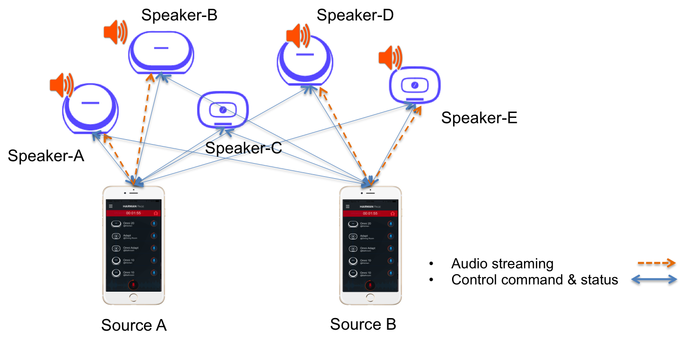

Architecture Overview
===========================

Overview
---------

Overall Configuration
^^^^^^^^^^^^^^^^^^^^^^

There are two types of entities in HKWirelessHD audio streaming - one is source device and the other is destination device. Source device sends audio stream to destination devices (speakers), and destination devices receive the audio stream from source and play it. In HKWirelessHD audio, audio streaming is in a one-to-many way. That is, there is one single source device sending an audio stream, and multiple destination devices receive the audio stream by synchronizing with other speakers.

In case of multi-channel streaming, each speaker is assigned with a role to process a dedicated audio channel. For example, a speaker can play either left channel or right channel in stereo mode.

Source device can be iOS device, such as iPhone and iPad, and destination devices are Harman Kardon Omni speakers (Omni Adapt, Omni 10, Omni 20, Omni Bar, etc.) You can find more information on HK Omni speakers at http://www.harmankardon.com/content?ContentID=omni-v2.

.. figure:: img/architecture-overview/architecture.png

Use of HKWirelessHD API to stream audio to Omni Speakers
^^^^^^^^^^^^^^^^^^^^^^^^^^^^^^^^^^^^^^^^^^^^^^^^^^^^^^^^^^

To send audio stream to destination devices, an App has to use HKWirelessHD API. HKWirelessHD SDK provides the library of the APIs for arm32/64bit architecture. 

Note that as of date of writing, no x86 architecture is supported, so developer cannot use iOS Simulator for running the app with HKWirelessHD API.

Communication channels between source and destinations
^^^^^^^^^^^^^^^^^^^^^^^^^^^^^^^^^^^^^^^^^^^^^^^^^^^^^^^^^^

As shown in the figure above, there are two kind of communications between a source device and (multiple) destination devices.

- Channel for audio streaming - one way communication from a source to multiple destinations
	- This channel is used for transmitting audio data to destination speakers
- Channel for control commands and device status - bidirectional communication
	- This channel is used to send commands from the source to the destinations to control the device, like volume control, etc.
	- Destination device can also send commands to the source device in some cases.
		- For example, a speaker which is not belonging to the current playback session can send a command to the source to add itself to the current playback session.
		- User can add Omni 10 or Omni 20 speaker to the current running playback session by long-pressing the Home button on the control panel. Please refer to Omni 10 or 20 User's Manual for more information.
	- This channel is also used to send the device information and the status data of a destination speakers to the source device.
		- Device information includes the speaker name, the group name, IP address and port number, firmware version, etc.
		- Device status information includes the status about the device availability and changes of its attributes, whether or not it is playing music, Wi-Fi signal strength, volume change, etc.

Asynchronous Communication
^^^^^^^^^^^^^^^^^^^^^^^^^^^^^^^^^^^^^^^^^^^^^^^^^^^^^^^^^^

The communication between the source device and the destination speakers are accomplished in asynchronous way. Asynchronous behavior is natural because all the commands and status updates are executed in a way like RPC (Remote Procedure Call). Even more, audio streaming always involves some amount of buffering of audio data packets, so the timing gap between the source and the destinations is inevitable.

Below are some examples of asynchronous communications.	

- Device availability
	- When a speaker is turned on, the availability of the speaker is reflected to the source device a few second later. This is because several steps are involved to be attached the network and become discoverable by other speakers in the same network. Likewise, if a speaker is turned off or disconnected from the network, its unavailability is reflected to the source device a few second later.

- Playback control
	- When the source device starts music playback and streaming to destination speakers, actual playback in destination speakers occurs a few hundreds milliseconds later. Similar things occur when the source pauses or stops the current audio streaming, although stop or pause requires much less time.

- Volume Control
	- When the source changes the volume level of speakers, actual volume changes occur a few millisecond later.

Speaker Management
^^^^^^^^^^^^^^^^^^^^^^^^^^^^^^^^^^^^^^^^^^^^^^^^^^^^^^^^^^

Whenever a speaker updates its status, the latest status information should be updated on the source device side as well. HKWirelessHD API manages the latest device status information inside DeviceInfo instances. HKWControlHandler instance maintains a list of DeviceInfo objects, each of which corresponds to a speaker found in the network.

The detailed description on each attribute in the device are described in DeviceInfo.h.

Visibility of Speakers
------------------------

Any speakers in a network are visible to source devices (iOS devices) if a source device successfully initializes the HKWControlHandler when it starts up. Source device can be multiple. This means, even in the case that a speaker is being used by a source device, the status of each speaker is also visible to all other source devices in the network, once they are successfully initialized with HKWControlHandler.

For example, as described in the figure below, let's assume that Speaker-A and Speaker-B are being used by Source A, and Speaker-D and Speaker-E are being used by Source B. Once Source A and Source B initialize HKWControlHandler, then all the speakers from Speaker-A to Speaker-E are also visible both to Source A and Source B. Therefore, it is possible for Source A to add Speaker-D to its on-going playback session, even if it is being used by Source B. In this case, Speaker-D stops playing the audio stream from Source B, and join the on-going playback audio stream from Source A.

There is an API, called isPlaying(), in DeviceInfo.h to return a boolean value indicating if the speaker is being playing audio or not, regardless that which source audio stream comes from.

Controlling Speakers and Handling the Events from Speakers
-------------------------------------------------------------

.. figure:: img/architecture-overview/control-handler.png

Controlling speakers
^^^^^^^^^^^^^^^^^^^^^^^^^^^^^^^^^^^^^^^^^^^^^^^^^^^^^^^^^^

Speaker controls, like start/pause/resume/stop audio streaming, change volume level, etc. are done by calling APIs provided by the HKWControlHandler singleton object. The app just needs to acquire the HKWControlHandler object, initialize it, and then use it to control the speakers. For example, as shown in the figure above, the app can call playCAF() with the HKWControlHandler to start to play a CAF audio file. The control APIs are described in HKWControlHandler.h.

HKWControlHandler is a singleton object, and it can be acquired by calling as below. Note that there is no initializer API for the object. The sharedInstance() singleton API will create and initialize it if there is no instance in the runtime.

.. code-block:: swift

	HKWControlHandler.sharedInstance()

Handling events from speakers
^^^^^^^^^^^^^^^^^^^^^^^^^^^^^^^^^^^^^^^^^^^^^^^^^^^^^^^^^^

On the other hand, the events from speakers are sent to the app through Delegate protocol APIs. By implementing the event handler delegate functions (in ViewController class in most cases), you can receive and handle the events from speakers. Whenever an event occurs from speakers, the corresponding handler is called and the event information is passed to the handler as parameter. 

The SDK provides two delegate protocols:

- HKWDeviceEventHandlerDelegate (defined in HKWDeviceEventHandlerSingleton.h)
	- All the events related to the status of speakers. There are two cases the event is sent:
		- device status updated
		- error occurred
	- To register an object as the delegate, do as below (self is the object that implements the delegate protocols):
		- ``HKWDeviceEventHandlerSingleton.sharedInstance().delete = self``

- HKWPlayerEventHandlerDelegate (defined in HKWPlayerEventHandlerSingleton.h)
	- All the events related to play music.
		- play ended
		- playback state changed
		- playback time changed
		- volume changed
	- To register an object as the delegate, do as below (self is the object that implements the delegate protocols):
		- ``HKWPlayerEventHandlerSingleton.sharedInstance().delete = self``

