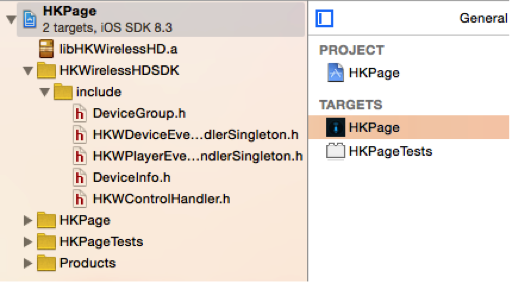

Getting Started Guide (iOS)
===========================

HKWirelessHD SDK supports both Objective-C and Swift. This document assumes that developer creates his/her app using the Swift language.

In the section, we will use the HKPage app as an example.

Project Setup with HKWireless (normal version)
----------------------------------------------

Include HKWirelessHDSDK into your project
~~~~~~~~~~~~~~~~~~~~~~~~~~~~~~~~~~~~~~~~~

- Add HKWirelessHDSDK to your project by dragging and dropping the HKWirelessHDSDK folder into the project navigator. Select “Create groups”, and click finish. By doing this, the include header path for HKWirelessHD SDK is added to your project. We need only the “include” folder, so you may remove the references to the other items in the folder. (Right click on any items you want to remove, select “Delete”, and then select “Remove References”.)

Add libHKWirelessHD.a as link binary
~~~~~~~~~~~~~~~~~~~~~~~~~~~~~~~~~~~~

- Project Setting > Your Targets > Build Phases > Link Binary With Libraries 
	- Click '+', and then click "Add Other..."
	- Find 'libHKWirelessHD.a' in HKPage/HKWirelessHDSDK/lib, and add it.

.. figure:: img/getting-started-iOS/project-setting-1.png

After adding the HKWirelessHDSDK folder into your project and adding libHKWirelessHD.a, the project navigator will look like as below:

Add Swift Bridging Header
~~~~~~~~~~~~~~~~~~~~~~~~~

.. note:: 

    The example app we'll walk through here is discussed in greater detail in the `Building Your First SmartApp <introduction/introduction-to-the-ide/building-your-first-smartapp.html>`__ section of the `Introduction <introduction/index.html>`__.

Walkthrough
-----------

Step 1: Register a developer account
~~~~~~~~~~~~~~~~~~~~~~~~~~~~~~~~~~~~

If you haven't already, `Register for a developer account <https://graph.api.smartthings.com/register/developer>`__

---- 

Step 2: Go the developer environment page
~~~~~~~~~~~~~~~~~~~~~~~~~~~~~~~~~~~~~~~~~

Head over to the `developer environment page <https://graph.api.smartthings.com>`__. This is where you can manage your hubs, devices, view logging, and more. We're going to use the web-based IDE to create a SmartApp.

----

Step 3: Create your SmartApp
~~~~~~~~~~~~~~~~~~~~~~~~~~~~

Click on the "My SmartApps" link:

.. image:: img/quick-start/dev_hub_smartapp_menu.png

This will take you to your SmartApps page, where you can view and manage your SmartApps. Press the "New SmartApp" button on the right of the page:

.. image:: img/quick-start/ide_new_smartapp_button.png

Give your app a name, author, and description. Set the category to "My Apps". Then click the "Create" button.

.. image:: img/quick-start/new-smart-app-form.png

This will take you to the IDE, where you will see some code has been filled in for you.

There are three core methods that must be defined for SmartApps:

- ``preferences`` is where we configure what information we need from the user to run this app. 
- ``installed`` is the method that is called when this app is installed. Typically this is where we subscribe to events from configured devices.
- ``updated`` is the method that is called when the preferences are updated. Typically just unsubscribes and re-subscribes to events, since the preferences have changed.

Our example is going to be pretty simple - we will create an app that triggers a light to come on when a door opens.

At a high level, our app will need to:

#. Gather the devices (door and light) to use for this app
#. Monitor the door device - if it is opened, turn the light on. If it is closed, turn it off.
        
----

Step 4: Fill in the preferences block
~~~~~~~~~~~~~~~~~~~~~~~~~~~~~~~~~~~~~

The first thing we need to do is gather the sensors and switches we want this SmartApp to work with. We do this through the ``preferences`` definition.

In the IDE, replace the generated preferences block with the following:

.. code-block:: groovy

    preferences {
        // What door should this app be configured for?
        section ("When the door opens/closes...") {
            input "contact1", "capability.contactSensor", 
                  title: "Where?"
        }
        // What light should this app be configured for?
        section ("Turn on/off a light...") {
            input "switch1", "capability.switch"
        }
    }

Click the "Save" button above the editor.

.. note::

    When interacting with devices, SmartApps should use capabilities to ensure maximum flexibility (that's the "capability.contactSensor" above). The available capabilities can be found on the :ref:`capabilities_taxonomy` page.

    More information about preferences can be found in the `Preferences and Settings section <smartapp-developers-guide/preferences-and-settings.html>`__ of the `SmartApp Developer's Guide <smartapp-developers-guide/index.html>`__. 

----

Step 5: Subscribe to events
~~~~~~~~~~~~~~~~~~~~~~~~~~~

In the IDE, note that there is an empty ``initialize`` method defined for you. This method is called from both the ``installed`` and ``updated`` methods. 

This is where we will subscribe to the device(s) we want to monitor. In our case, we want to know if the door opens or closes.

Replace the ``initialize`` method with this:

.. code-block:: groovy

    def initialize() {
        subscribe(contact1, "contact", contactHandler)
    }

Note the arguments to the subscribe method. The first argument, "contact1", corresponds to the name in the preferences input for the contact sensor. This tells the SmartApp executor what input we are subscribing to. The second parameter, "contact", is what value of the sensor we want to listen for. In this case, we use "contact" to listen to all value changes (open or closed). The third parameter, "contactHandler", is the name of a method to call when the sensor has a state change. Let's define that next!

(don't forget to click the "Save" button!)

.. note::

    More information about events and subscriptions can be found in the `Events and Subscriptions section <smartapp-developers-guide/simple-event-handler-smartapps.html>`__ of the `SmartApp Developer's Guide <smartapp-developers-guide/index.html>`__. 

----

Step 6: Define the event handler
~~~~~~~~~~~~~~~~~~~~~~~~~~~~~~~~

Add the following code to the bottom of your SmartApp:

.. code-block:: groovy

    // event handlers are passed the event itself
    def contactHandler(evt) { 
        log.debug "$evt.value"
    
        // The contactSensor capability can be either "open" or "closed"
        // If it's "open", turn on the light! 
        // If it's "closed" turn the light off.
        if (evt.value == "open") {
            switch1.on();
        } else if (evt.value == "closed") {
            switch1.off();
        }
    }

Click the "Save" button, and let's try it out!

----

Step 7: Run it in the simulator
~~~~~~~~~~~~~~~~~~~~~~~~~~~~~~~~

To the right of the editor in the IDE, you should see a "Location" field:

.. image:: img/quick-start/ide-set-location.png

Select the location of your hub (if you have only one hub, it will be selected by default), and click "Set Location". 

Now you can pick some devices if you have them, or create some virtual devices. 

.. image:: img/quick-start/ide-install-app.png

Once you've picked some devices, click "Install" to launch the simulator:

.. image:: img/quick-start/ide-simulator.png

Try changing the contact sensor from closed to open - you should see the switch in the simulator turn on. If you used a real switch, you should see the light actually turn on or off! 

Also note the log statements in the log console. Logging is extremely useful for debugging purposes.

----

Bonus Step: Publish your SmartApp (for you only)
~~~~~~~~~~~~~~~~~~~~~~~~~~~~~~~~~~~~~~~~~~~~~~~~

We've run our app in the simulator, which is a great way to test as we develop. But we can also publish our app so we 
can use it from our smart phone, just like other SmartApps. Let's walk through those steps.

On top of the IDE, there's a "Publish" button right next to the Save button. Click it, and select "For me":

.. image:: img/quick-start/ide-publish-for-me.png

You should see a message indicating your app published successfully.

On your mobile phone, launch the SmartThings app, and go to the Dashboard. Towards the bottom, click the "+" icon:

.. image:: img/quick-start/mobile-install-my-app.png

In the SmartSetup screen, scroll all the way to the right to select "My Apps". You should see your app there - select it and you can install it just like any other SmartApp! (you'll need physical devices to successfully install this app)

.. image:: img/quick-start/mobile-myapps-install.png

Next Steps
----------

This tutorial has shown you how to set up a developer account, use the IDE to create a simple SmartApp, use the simulator to test your SmartApp, and publish your SmartApp to your mobile phone. 

In addition to using this documentation, the best way to learn is by looking at existing code and writing your own. In the IDE, there are several templates that you can review. These are great sources for learning SmartThings development! In fact, the SmartApp we built borrows heavily from (OK, it's a total clone) the "Let There Be Light" SmartApp. 

