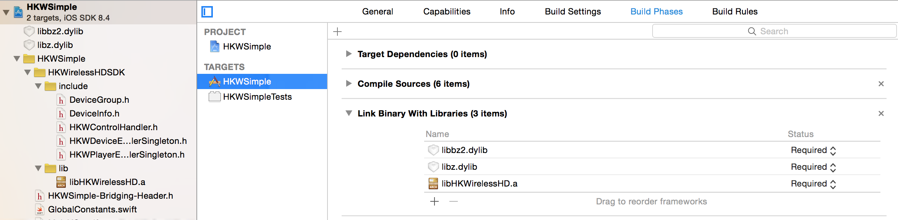

Getting Started Guide (iOS)
===========================

HKWirelessHD SDK supports both Objective-C and Swift. This document assumes that developer creates his/her app using the Swift language.

There are two versions of SDK
- a normal version: HKWirelessHDSDK
- a lightweight version: HKWirelessHDSDKlw

Most of the features are common in the two version. The only difference is that the normal version includes an API for playing web streaming audio, while the lightweight version does not.

The reason we support the SDK as two separate version is that we know that many developers want a feature of web streaming. To support this feature, we need to include a version of FFMPEG library inside of the SDK library. But, some developers may want to use their own version of MMPEG to handle audio stream for some particular reasons.

Please see the descriptions of each version below and make a proper choice for your app.

- HKWirelessHD (normal version) : support web streaming audio
	- Only support 32bit (armv7) architecture. armv7s and arm64 are not supported.
	- Support webstreaming music playback.
	- libz.dylib and libbz2.dylib are required when linking.
	
- HKWirelessHDlw (lightweight version) : do not support web streaming audio
	- Supports both 32bit (armv7, armv7s) and 64bit architecture (arm64)
	- Do not support web streaming music playback (streaming music from HTTP server, etc.)
	- No other library required
		
So, if you do not need web streaming music playback for your app, you may use HKWirelessHDlw (lightweight) version. Otherwise, you should use HHWirelessHD version.

In the section, we will use HKWSimple app as an example of using the normal version and HKPage app as an example of using the lightweight version.

Project Setup with HKWirelessHDSDKlw (lightweight version)
-----------------------------------------------------------

Include HKWirelessHDSDKlw into your project
~~~~~~~~~~~~~~~~~~~~~~~~~~~~~~~~~~~~~~~~~~~~~

- Add *HKWirelessHDSDKlw* to your project by dragging and dropping the HKWirelessHDSDKlw folder into the project navigator.
- When you get a dialog saying *Choose options for adding these files* :,
	- Check the checkmark of *Copy items if needed*
	- Select *Create groups*, and click finish.
- By doing this, the include headers and libraries for HKWirelessHDSDKlw are added to your project. 

Make sure if libHKWirelessHDlw.a was added to your *Link Binary With Libraries*
~~~~~~~~~~~~~~~~~~~~~~~~~~~~~~~~~~~~~~~~~~~~~~~~~~~~~~~~~~~~~~~~~~~~~~~~~~~~~~~~~

- Project Setting > Your Targets > Build Phases > Link Binary With Libraries 
	- Check if *libHKWirelessHDlw.a* was added to the list.
	- If it was not added, add it by clicking *+* and *Add Other...*.

After adding the HKWirelessHDSDKlw folder into your project and adding libHKWirelessHD.a, the project navigator will look like as below:

.. figure:: img/getting-started-iOS/project-setting-lw-1.png

Add Swift Bridging Header
~~~~~~~~~~~~~~~~~~~~~~~~~~~

HKWirelessHD SDK has been written in C++ and Objective-C. Therefore, when you use the SDK in Swift, you should include Swift Bridging Header in your project. To do this:

1. Go to Project Setting > Build Setting > Swift Compiler - Code Generation > Objective-C Bridging Header

.. figure:: img/getting-started-iOS/project-setting-3.png

2. Add [My-Project-Name]/[My-Project-Name]-Bridging-Header.h

	- In our example, it looks like : HKPage/HKPage-Bridging-Header.h

3. Add the following lines in the header file.

.. code-block:: swift

	#import "HKWControlHandler.h"
	#import "HKWPlayerEventHandlerSingleton.h"
	#import "HKWDeviceEventHandlerSingleton.h"

Add -lstdc++ as linker flag
~~~~~~~~~~~~~~~~~~~~~~~~~~~

- Project Setting > Your Targets > Build Settings > Linking > Other Linder Flags
	- Add “-lstdc++” in the text field

.. figure:: img/getting-started-iOS/project-setting-4.png

Project Setup with HKWirelessHDSDK (normal version)
-----------------------------------------------------------

Include HKWirelessHDSDK into your project
~~~~~~~~~~~~~~~~~~~~~~~~~~~~~~~~~~~~~~~~~~~~

- Add *HKWirelessHDSDK* to your project by dragging and dropping the HKWirelessHDSDK folder into the project navigator.
- When you get a dialog saying *Choose options for adding these files* :,
	- Check the checkmark of *Copy items if needed*
	- Select *Create groups*, and click finish.
- By doing this, the include headers and libraries for HKWirelessHDSDK are added to your project. 

Make sure if libHKWirelessHD.a was added to your *Link Binary With Libraries*
~~~~~~~~~~~~~~~~~~~~~~~~~~~~~~~~~~~~~~~~~~~~~~~~~~~~~~~~~~~~~~~~~~~~~~~~~~~~~~~~~

- Project Setting > Your Targets > Build Phases > Link Binary With Libraries 
	- Check if *libHKWirelessHDlw.a* was added to the list.
	- If it was not added, add it by clicking '+' and *Add Other...*.

Add libz.dylib and libbz.dylib to your *Link Binary With Libraries*
~~~~~~~~~~~~~~~~~~~~~~~~~~~~~~~~~~~~~~~~~~~~~~~~~~~~~~~~~~~~~~~~~~~~~~~~~~~~~~~~~

- Project Setting > Your Targets > Build Phases > Link Binary With Libraries 
	- Click '+' and find and add *libz.dylib* and *libbz2.lib* to the list

After adding the HKWirelessHDSDKw folder into your project and adding libHKWirelessHD.a, libz.dylib and libbz2.dylib, the project navigator will look like as below:

Add Swift Bridging Header and -lstdc++ as linker flag
~~~~~~~~~~~~~~~~~~~~~~~~~~~~~~~~~~~~~~~~~~~~~~~~~~~~~~~

Follow the instruction for adding Swift bridging header and -lstdc++ linker flag as described in the previous section.

Creating a Sample Application (HKWSimple)
-------------------------------------------

In this section, we explain how to create a HKWirelessHD iOS App. We will create a simple iOS app called **HKWSimple** that can play WAV or MP3 file, and also play Web-based streaming music with HTTP protocol.

As shown in the figure, the app is composed of a sequence of UIViewController starting from a TableViewController showing a list of available speakers, and then a TableViewController showing a list of songs to play, and then finally a ViewController that shows a playback control panel with Play/Stop buttons and Volume control buttons.

.. figure:: img/getting-started-iOS/hkwsimple-1.png

1. Project Setup
~~~~~~~~~~~~~~~~~

For the project setup, please refer to the previous session of **Project Setup with HKWirelessHDSDK (normal version)**.

2. Initialize HKWirelessHD Controller
~~~~~~~~~~~~~~~~~~~~~~~~~~~~~~~~~~~~~~

In HKWSimple app, the initialization of HKWirelessHD Controller is done in the first ViewController called MainVC.

.. code-block:: swift

	class MainVC: UIViewController {
		var g_alert: UIAlertController!
		
		override func viewDidLoad() {
			super.viewDidLoad()
			
			if !HKWControlHandler.sharedInstance().isInitialized() {
				// show the network initialization dialog
				println("show dialog")
				g_alert = UIAlertController(title: "Initializing", message: "If this dialog does not disappear, please check if any other HK WirelessHD App is running on the phone and kill it. Or, your phone is not in a Wifi network.", preferredStyle: .Alert)
				self.presentViewController(g_alert, animated: true, completion: nil)
			}
		}

		override func viewDidAppear(animated: Bool) {
			if !HKWControlHandler.sharedInstance().initializing() && !HKWControlHandler.sharedInstance().isInitialized() {
				dispatch_async(dispatch_get_global_queue(DISPATCH_QUEUE_PRIORITY_DEFAULT, 0), {
					if HKWControlHandler.sharedInstance().initializeHKWirelessController(kLicenseKeyGlobal) != 0 {
						println("initializeHKWirelessControl failed : invalid license key")
                    	return
                	}
                	println("initializeHKWirelessControl - OK");
                
                	// dismiss the network initialization dialog
                	if self.g_alert != nil {
						self.g_alert.dismissViewControllerAnimated(true, completion: nil)
                	}
				})
			}
		}
	}

