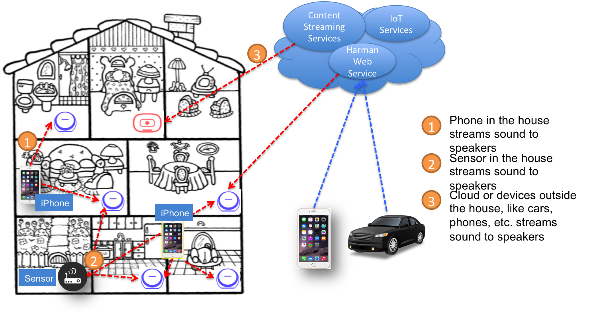
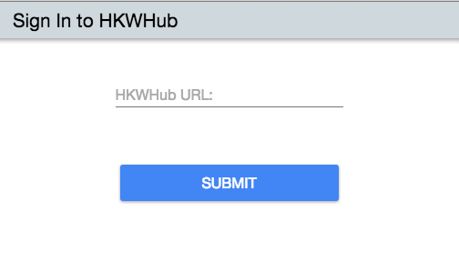

HKWHub App - Making your Omni speakers connected from any devices (sensors) or services
=========================================================================================

Overview of HWKHub
---------------------

HKWHub app is an iOS that that uses HKWirelessHD SDK and acts as a Web Hub that handles HTTP requests to control speakers and stream music. It enables any type of "connected" devices (like sensors or smart devices) and cloud-based service to connect HK Omni speakers and stream music.

.. note::

	Please note that HKWHub app is an on-going project, and not yet ready for production. We hope developers play around with this app and implement their own apps or services by integrating many other IoT devices or services and adding intelligence to the Hub app.
	
	Any feedback or request for new APIs and features are always welcome.

Use Cases
~~~~~~~~~~~~

HKWHub App 
~~~~~~~~~~~~

Web Hub handles all the requests from and response to the sensors or the clouds to control audio play with wireless speakers in the house.

Features
^^^^^^^^^
- Supports integration with clouds and sensors as well as smartphones
	- Receives the requests from clouds (web service) outside or sensors in the house
	- Translates the requests into HKWirelessHD commands and controls the speakers based on the requests.
	- Sends response with status of speakers to the cloud if necessary 
- Central Music Playlist manager
	- Maintain user’s playlist from the iOS local music library and streaming services, like MixRadio, etc.
	- Maintain a collection of sound files used for IoT use cases, like door bell, etc.

Usage
^^^^^^^^
- User puts an iOS device on the cradle and run WebHub app. Then the app acts as Web Hub. (AppleTV can be a nice iOS device for WebHub.)

.. figure:: img/hub/hub-app.png

Overall Architecture
~~~~~~~~~~~~~~~~~~~~~~~

Web Hub handles all the requests from and response to the sensors or the clouds to control audio play with wireless speakers in the house.

.. figure:: img/hub/architecture.png

----

Quick Guide to HKWHub App
-------------------------------

.. Note::

	Please check out `HKWHub app demo video`_.

.. _`HKWHub app demo video`: https://www.youtube.com/watch?v=_ljpReAvk0g&feature=youtu.be

Run HKWHub app on your iOS device
~~~~~~~~~~~~~~~~~~~~~~~~~~~~~~~~~~~~~~

.. figure:: img/hub/hub-first-run.png
	:scale: 50

Copy the URL information (http://192.168.1.192:8080/). This is the HTTP server address. You need to use this URL for your every REST API request.

Go to Setup (via Hamburger icon) menu, and add music items from iOS Music library. 

.. figure:: img/hub/medialist.png
	:scale: 30

Use ``curl`` command or web browser to send REST requests
~~~~~~~~~~~~~~~~~~~~~~~~~~~~~~~~~~~~~~~~~~~~~~~~~~~~~~~~~~~~

Use **curl** command in your shell, or use your web browser to send  HTTP requests to the server URL. In this example, we will use **curl** commands.

a. Init session
^^^^^^^^^^^^^^^
``curl "http://192.168.1.192:8080/v1/init_session"``

This returns the session id. 

b. Add alls speaker to session
^^^^^^^^^^^^^^^^^^^^^^^^^^^^^^^^^^^^^^^^^^^^^^^^^^

By default, none of speakers is selected for playback at first. You need to add one or more speakers to play audio.
To add all speakers to playback session, use ``set_party_mode``. **Party Mode** means that all speakers are playing a same audio altogether.

``curl "http://192.168.1.192:8080/v1/set_party_mode?SessionID=1000"``

c. Add a speaker to session
^^^^^^^^^^^^^^^^^^^^^^^^^^^^^^^^^^^^^^^^^^^^^^^^^^

If you want to add a speaker to session, use ``add_device_to_session`. This command does not impact other speakers regardless of their status.

``curl "http://192.168.1.192:8080/v1/add_device_to_session?SessionID=1000&DeviceID="34317244381360"``

d. Get the media list
^^^^^^^^^^^^^^^^^^^^^^^
``curl "http://192.168.1.192:8080/v1/media_list?SessionID=1000"``

Here, SessionID should be the session id you got from ``init_session``. You will get a list of media in JSON like below

.. code-block:: json

	{"MediaList": [
		{"PersistentID":"7387446959931482519",
		"Title":"I Will Run To You",
		"Artist":"Hillsong",
		"Duration":436,
		"AlbumTitle":"Simply Worship"
		},
		{"PersistentID":"5829171347867182746",
		"Title":"I'm Yours [ORIGINAL DEMO]",
		"Artist":"Jason Mraz",
		"Duration":257,
		"AlbumTitle":"Wordplay [SINGLE EP]"}
	]}

e. Play a media item listed in the hub app
^^^^^^^^^^^^^^^^^^^^^^^^^^^^^^^^^^^^^^^^^^^^^^^^^^^^^^^^^^^^^^^^^
If you want to play a media item listed in the hub app, use ``play_hub_media`` by specifying the media item with ``PersistentID``. The ``PersistentID`` is available by ``media_list`` command.

.. note::

	Note that, before doing this, at least a speaker must be selected (added to session) in advance. If not, then the playback will fail. 

``curl "http://192.168.1.192:8080/v1/play_hub_media?SessionID=1000&PersistentID=5829171347867182746"``

f. Play a media item in the hub with speaker list
^^^^^^^^^^^^^^^^^^^^^^^^^^^^^^^^^^^^^^^^^^
You can play a media item in the hub app by specifying the list of speakers.

``curl "http://192.168.1.192:8080/v1/play_hub_media_selected_speakers?SessionID=1000&PersistentID=5829171347867182746&DeviceIDList=34317244381360,129321920968880"``

The list of speakers are listed by the parameter ``DeviceIDList`` with delimitor ",".

g. Play a HTTP streaming media
^^^^^^^^^^^^^^^^^^^^^^^^^^^^^^^^^^^^^^^^^^^^^^^^^^^^^^^^^^^^^^^^^
``curl "http://192.168.1.192:8080/v1/play_web_media?SessionID=1000&MediaUrl=http://seonman.github.io/music/hyolyn.mp3"``

h. Stop playing
^^^^^^^^^^^^^^^^^^^^^^^^^^^^^^^^^^^^^^^^^^^^^^^^^^^^^^^^^^^^^^^^^
``curl "http://192.168.1.192:8080/v1/stop_play?SessionID=1000"``

i. Set Volume
^^^^^^^^^^^^^^^^^^^^^^^^^^^^^^^^^^^^^^^^^^^^^^^^^^^^^^^^^^^^^^^^^
``curl "http://192.168.1.192:8080/v1/set_volume?SessionID=1000&Volume=30"``

.. note::

	Please see the REST API specification for more information and examples.

Use ``WebHubWebApp`` to play music
~~~~~~~~~~~~~~~~~~~~~~~~~~~~~~~~~~~~
The source code of HKWHub app also contains a Web app to test the Hub app. The UI is created using Polymer v0.5 (https://www.polymer-project.org/0.5/). 

- Unzip WebHubWebApp.zip. You will see the following sub directories.
	- bower_components : This is the folder for polymer library
	- hkwhub : this is the folder containing the WebHubApp that we will run.

.. code-block:: shell

	$ cd WebHubWebApp
	$ python -m SimpleHTTPServer
	
You will get some log messages like "Serving HTTP on 0.0.0.0 port 8000 ..."

Next, launch your web browser (Chrome, Safari, ...) and go to http://localhost:8000/hkwhub/

.. note::

	Your iOS device running HKWHub app and your Desktop PC running web browser should be in the same network.

At the fist screen looking like this:

Enter the URL that the HKWHub app says: http://192.168.1.192:8080/, like this:

.. figure:: img/hub/hub-enter-url.png

If you press **Submit**, then you will see the first screen like below. This is the list of media items available at the HKWHub app. 

.. figure:: img/hub/hub-playlist.png

Now you can click one of items to play audio, and then move to **Media Player** tab to control playback (pause/resume/stop) and control volume. 

.. figure:: img/hub/hub-media-player.png

In **Speaker List** tab, you can select and turn on/off speaker.

.. figure:: img/hub/hub-speaker-list.png

Session Management
-------------------

Since the HKWHub app should be able to handle REST HTTP requests from more than one clients at the same time, the HKWHub app manages the requests with session information associated with the priority when the session is initialized.

The following is the policy of the session management:

Session Creation
~~~~~~~~~~~~~~~~~
- When a client wants to access speakers through the HKWHub app, it must create a session first. (Use ``init_session`` command.)
- When a client initializes session, it also sets the priority of the session (using ``Priority=<priority value>`` parameter).

Priority of Session
~~~~~~~~~~~~~~~~~~~~~
- Each session is associated with a priority value which will be used to determine which request can override the current on-going playback session.
- The priority value is specified as parameter (``Priority``) when the client calls ``init_session``.
	- If the command does not specify the Priority parameter, 100 is set as default value.
- If the priority of the session of a new playback request, such as ``play_hub_media`` or ``play_web_media``, and so on, is greater than or equal to the priority of the current session, then it interrupts the current playback session, that is, stops the current playback session and start a new playback for itself.
	- The playback status of the interrupted session becomes ``PlayerStateStopped``. (see the related API in the next section)
	- Even if a session is interrupted by a higher or equal priority playback request, the session is still valid. So, it can continue to send requests with the session id.
	
The following diagrams show how HKWHub app handles incoming playback request based on the session priorities.

Session Timeout
~~~~~~~~~~~~~~~~~
- A session becomes expired and invalid when about 60 minutes is passed since the last command was received.
- All requests with expired session will be denied and "SessionNotFound" error returns.

----

REST API Specification
-----------------------

This specification describes the REST API for controlling HKWHub app remotely to control HK Omni speakers and stream audio to the speakers.

All the APIS are in REST API protocol.

Session Management
~~~~~~~~~~~~~~~~~~~~

Start Session
^^^^^^^^^^^^^^

- API: GET /v1/init_session?Priority=<priority value>
- Response
	- Returns a unique session id
	- The session id will be used for upcoming requests.
- Example:
	- Request: ``http://192.168.1.10/v1/init_session?Priority=100``
	- Response: 

.. code-block:: json

	{"SessionID" : "1000"}

----

Close Session
^^^^^^^^^^^^^^

- API: GET /v1/close_session?SessionID=<session id>
- Response
	- Returns true or false indicating success or failure
- Example:
	- Request: ``http://192.168.1.10/v1/close_session?SessionID=1000``
	- Response: 

.. code-block:: json

	{"Result" : "true"}

----

Device Management
~~~~~~~~~~~~~~~~~~~~

Get device cound
^^^^^^^^^^^^^^^^^^^^^^^^^^^^^^^^^^^^^^^^^^^^^^

- API: GET /v1/device_count?SessionID=<session id>
- Response
	- Returns the number of devices connected to the network
- Example:
	- Request: ``http://192.168.1.10/v1/device_count?SessionID=1000``
	- Response: 

.. code-block:: json

	{"DeviceCount":"2"}

----

Get the list of Devices and their information
^^^^^^^^^^^^^^^^^^^^^^^^^^^^^^^^^^^^^^^^^^^^^^

- API: GET /v1/device_list?SessionID=<session id>
- Response
	- Returns the list of devices with all the device information
- Example:
	- Request: ``http://192.168.1.10/v1/device_list?SessionID=1000``
	- Response: 

.. code-block:: json

	{"DeviceList":
		[{"GroupName":"Bathroom", 
		"Role":21, 
		"MacAddress":"b0:38:29:1b:36:1f", 
		"WifiSignalStrength":-47, 
		"Port":44055, 
		"Active":true, 
		"DeviceName":"Adapt1", 
		"Version":"0.1.6.2", 
		"ModelName":"Omni Adapt", 
		"IPAddress":"192.168.1.40", 
		"GroupID":"3431724438", 
		"Volume":47, 
		"IsPlaying":false, 
		"DeviceID":"34317244381360"
		},
		{"GroupName":"Temp", 
		"Role":21, 
		"MacAddress":"b0:38:29:1b:9e:75", 
		"WifiSignalStrength":-53, 
		"Port":44055, 
		"Active":true, 
		"DeviceName":"Adapt", 
		"Version":"0.1.6.2", 
		"ModelName":"Omni Adapt", 
		"IPAddress":"192.168.1.39", 
		"GroupID":"1293219209", 
		"Volume":47, 
		"IsPlaying":false, 
		"DeviceID":"129321920968880"
		}]
	}

----

Get the Device Information
^^^^^^^^^^^^^^^^^^^^^^^^^^^^^^^^^^^^^^^^^^^^^^

- API: GET /v1/device_info?SessionID=<session id>&DeviceID=<device id>
- Response
	- Returns the information of the device
- Example:
	- Request: ``http://192.168.1.10/v1/device_info?SessionID=1000&DeviceID=129321920968880``
	- Response: 

.. code-block:: json

	{"GroupName":"Temp", 
	"Role":21, 
	"MacAddress":"b0:38:29:1b:9e:75", 
	"WifiSignalStrength":-52, 
	"Port":44055, 
	"Active":true, 
	"DeviceName":"Adapt", 
	"Version":"0.1.6.2", 
	"ModelName":"Omni Adapt", 
	"IPAddress":"192.168.1.39", 
	"GroupID":"1293219209", 
	"Volume":47, 
	"IsPlaying":true, 
	"DeviceID":"129321920968880"}

----

Add a Device to Session
^^^^^^^^^^^^^^^^^^^^^^^^^^^^^^^^^^^^^^^^^^^^^^

- API: GET /v1/add_device_tosession?SessionID=<session id>&DeviceID=<device id>
- Response
	- Returns true or false
- Example:
	- Request: ``http://192.168.1.10/v1/add_device_to_session?SessionID=1000&DeviceID=129321920968880``
	- Response: 

.. code-block:: json

	{"Result":"true"}

----

Remove a Device from Session
^^^^^^^^^^^^^^^^^^^^^^^^^^^^^^^^^^^^^^^^^^^^^^

- API: GET /v1/remove_device_from_session?SessionID=<session id>&DeviceID=<device id>
- Response
	- Returns true or false
- Example:
	- Request: ``http://192.168.1.10/v1/remove_device_from_session?SessionID=1000&DeviceID=129321920968880``
	- Response: 

.. code-block:: json

	{"Result":"true"}
	

----

Media Playback Management
~~~~~~~~~~~~~~~~~~~~~~~~~~~~~~~~~~~~~~~

Get the list of stored media
^^^^^^^^^^^^^^^^^^^^^^^^^^^^^^

- API: GET /v1/media_list?SessionID=<session id>
- Response
	- Returns JSON of the list of store media in the HKWHub app.
- Example:
	- Request: ``http://192.168.1.10/v1/media_list?SessionID=1000``
	- Response: 

.. code-block:: json

	{"MediaList": [
		{"PersistentID":"7387446959931482519",
		"Title":"I Will Run To You",
		"Artist":"Hillsong",
		"Duration":436,
		"AlbumTitle":"Simply Worship"
		},
		{"PersistentID":"5829171347867182746",
		"Title":"I'm Yours [ORIGINAL DEMO]",
		"Artist":"Jason Mraz",
		"Duration":257,
		"AlbumTitle":"Wordplay [SINGLE EP]"}
	]}

----

Play a Song in the Hub Device
^^^^^^^^^^^^^^^^^^^^^^^^^^^^^^

- API: GET /v1/play_hub_media?SessionID=<session id>&PersistentID=<persistent id>
- Response
	- Play a song stored in the hub, and then return true or false.
- Example:
	- Request: ``http://192.168.1.10/v1/play_hub_media?SessionID=1000&PersistentID=7387446959931482519``
	- Response: 

.. code-block:: json

	{"Result":"true"}

----

Play a Song from Web Server
^^^^^^^^^^^^^^^^^^^^^^^^^^^^^^

- API: GET /v1/play_web_media?SessionID=<session id>&MediaUrl=<URL of the song>
- Response
	- Play a song from HTTP server, and then return true or false.
- Example:
	- Request: ``http://192.168.1.10/v1/play_web_media?SessionID=1000&MediaUrl=http://seonman.github.io/music/hyolyn.mp3``
	- Response: 

.. code-block:: json

	{"Result":"true"}

.. Note::
	This API call takes several hundreds millisecond to return the response.
	
----

Pause the Current Playback
^^^^^^^^^^^^^^^^^^^^^^^^^^^^^^

- API: GET /v1/pause_play?SessionID=<session id>
- Response
	- Pause the current playback, and then return true or false.
	- It can resume the current playback by calling ``resume_hub_media`` if and only if the playback is playing hub media. ``play_web_media`` cannot be resumed once it is paused or stopped.
- Example:
	- Request: ``http://192.168.1.10/v1/pause_play?SessionID=1000``
	- Response: 

.. code-block:: json

	{"Result":"true"}
	
----

Resume the Current Playback with Hub Media
^^^^^^^^^^^^^^^^^^^^^^^^^^^^^^^^^^^^^^^^^^^^^

- API: GET /v1/resume_hub_media?SessionID=<session id>&PersistentID=<persistent id>
- Response
	- Resume the current playback with Hub Media, and then return true or false.
- Example:
	- Request: ``http://192.168.1.10/v1/resume_hub_media?SessionID=1000&PersistentID=7387446959931482519``
	- Response: 

.. code-block:: json

	{"Result":"true"}

----

Stop the Current Playback
^^^^^^^^^^^^^^^^^^^^^^^^^^^^^^^^^^^^^^^^^^^^^

- API: GET /v1/stop_play?SessionID=<session id>
- Response
	- Stop the current playback with Hub Media, and then return true or false.
	- If the playback has stopped, then it cannot resume.
- Example:
	- Request: ``http://192.168.1.10/v1/stop_play?SessionID=1000``
	- Response: 

.. code-block:: json

	{"Result":"true"}
	
----

Get the Playback Status (Current Playback State and Elapsed Time)
^^^^^^^^^^^^^^^^^^^^^^^^^^^^^^^^^^^^^^^^^^^^^^^^^^^^^^^^^^^^^^^^^^

- API: GET /v1/playback_status?SessionID=<session id>
- Response
	- It returns the current state of the playback and also return the elapsed time (in second) of the playback.
	- If it is not playing, then the elapsed time is (-1)
	- The following is the value of each playback state:
		- PlayerStateInitialized : Play is ready
		- PlayerStatePlaying : Now playing audio
		- PlayerStatePaused : Playing is paused. It can resume.
		- PlayerStateStopped : Playing is stopped. It cannot resume.

	- Note that if the playback has stopped, then it cannot resume.
	- Developers need to check the playback status during the playback to handle any possible exceptional cases like interruption or errors. We recommedn to call this API every second.
- Example:
	- Request: ``http://192.168.1.10/v1/playback_status?SessionID=1000``
	- Response: 

.. code-block:: json

	{"PlaybackState":"PlayerStatePlaying",
	 "TimeElapsed":"15"}

----

Check if the Hub is playing audio
^^^^^^^^^^^^^^^^^^^^^^^^^^^^^^^^^^^^^^^^^^^^^^^^^^^^^^^^^^^^^^^^^^

- API: GET /v1/is_playing?SessionID=<session id>
- Response
	- Returns true (playing) or false (not playing)
- Example:
	- Request: ``http://192.168.1.10/v1/is_playing?SessionID=1000``
	- Response: 

.. code-block:: json

	{"IsPlaying":"true"}

Volume Control
~~~~~~~~~~~~~~~~~

Get Volume for all Devices
^^^^^^^^^^^^^^^^^^^^^^^^^^^^^^^^^^^^^^^^^^^^^^^^^^^^^^^^^^^^^^^^^^

- API: GET /v1/get_volume?SessionID=<session id>
- Response
	- Returns the average volume of all devices.
	- The range of volume is 0 (muted) to 50 (max)
- Example:
	- Request: ``http://192.168.1.10/v1/get_volume?SessionID=1000``
	- Response: 

.. code-block:: json

	{"Volume":"10"}

----

Get Volume for a particular device
^^^^^^^^^^^^^^^^^^^^^^^^^^^^^^^^^^^^^^^^^^^^^^^^^^^^^^^^^^^^^^^^^^

- API: GET /v1/get_volume_device?SessionID=<session id>&DeviceID=<device id>
- Response
	- Returns the  volume of a particular device
	- The range of volume is 0 (muted) to 50 (max)
- Example:
	- Request: ``http://192.168.1.10/v1/get_volume_device?SessionID=1000&DeviceID=1234567``
	- Response: 

.. code-block:: json

	{"Volume":"10"}

----

Set Volume for all devices
^^^^^^^^^^^^^^^^^^^^^^^^^^^^^^^^^^^^^^^^^^^^^^^^^^^^^^^^^^^^^^^^^^

- API: GET /v1/set_volume?SessionID=<session id>&Volume=<volume>
- Response
	- Returns true or false
- Example:
	- Request: ``http://192.168.1.10/v1/set_volume?SessionID=1000&Volume=10``
	- Response: 

.. code-block:: json

	{"Result":"true"}
	
----

Set Volume for a particular device
^^^^^^^^^^^^^^^^^^^^^^^^^^^^^^^^^^^^^^^^^^^^^^^^^^^^^^^^^^^^^^^^^^

- API: GET /v1/set_volume_device?SessionID=<session id>&DeviceID=<device id>&Volume=<volume>
- Response
	- Returns true or false
- Example:
	- Request: ``http://192.168.1.10/v1/set_volume_device?SessionID=1000&DeviceID=1234567&Volume=10``
	- Response: 

.. code-block:: json

	{"Result":"true"}