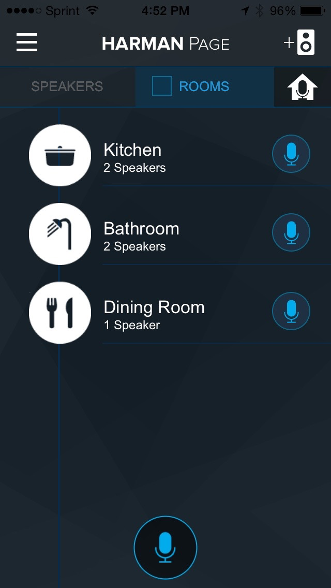
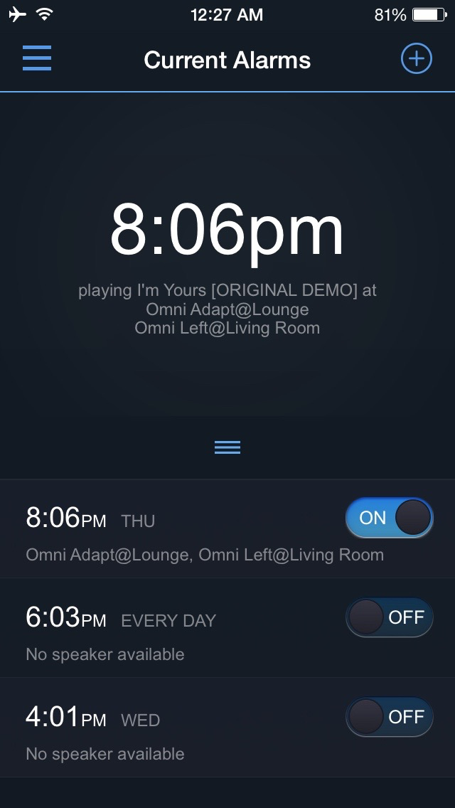
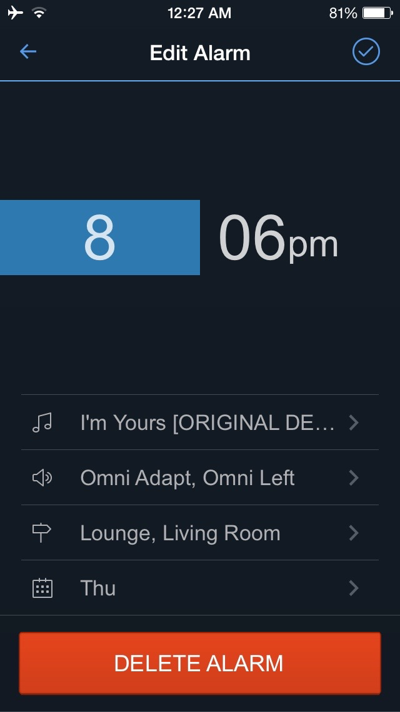
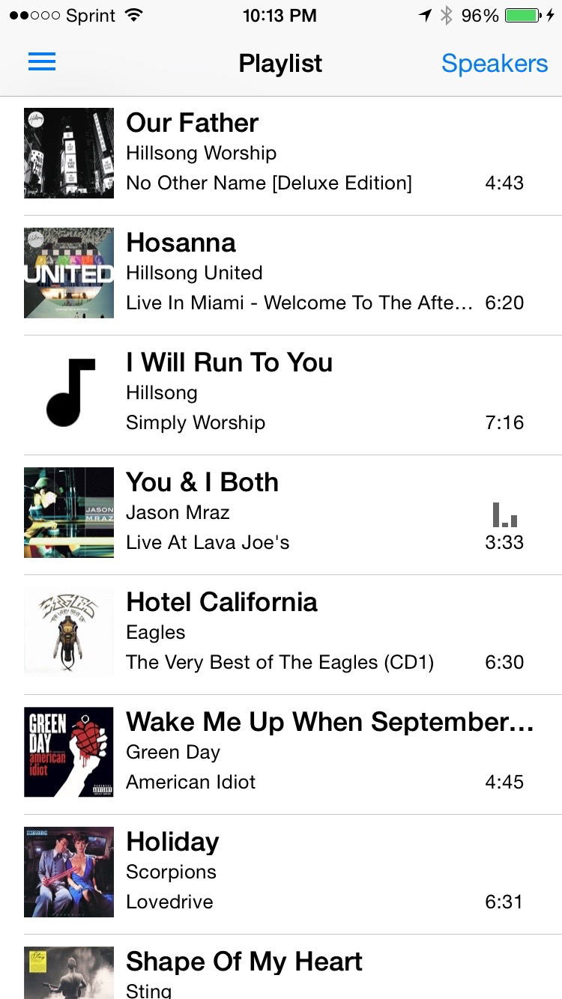
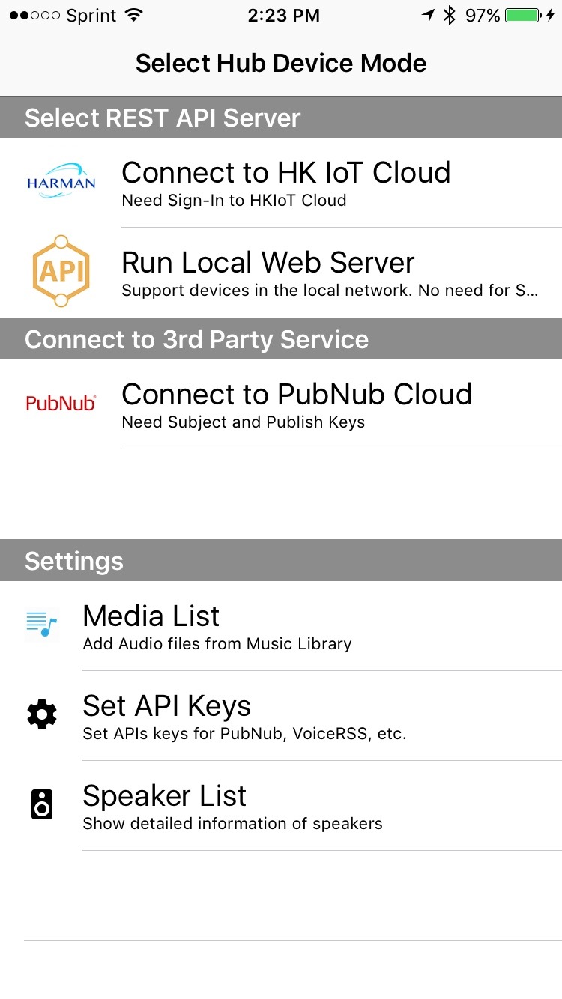
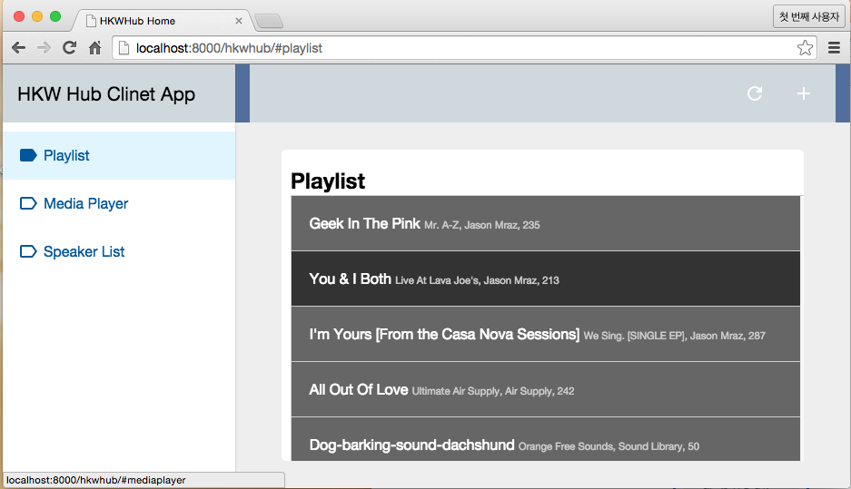

Overview of HKWirelessHD SDK (iOS)
==================================

The Harman Kardon WirelessHD (HKWirelessHD) SDK is provided for iOS 3rd party developers to communicate with Harman/Kardon Omni Series audio/video devices. The intent of this SDK is to provide the tools and libraries necessary to build, test and deploy the latest audio applications on the iOS platform.

What's Included
---------------

- HKWirelessHD library and header files
	- We provide two versions of SDK - a normal version and a lightweight version. See below for the information.
	- The reason we support the SDK as two separate version is that we know that many developers want a feature of web streaming. To support this feature, we need to include a version of FFMPEG library inside of the SDK library. But, some developers may want to use their own version of MMPEG to handle audio stream for some particular reasons. We describe more about these two versions in the `Getting Started (iOS)`_.
- License Agreement. 
- Sample Application source code Located within the Sample Apps page:
	- Page app
	- Wake app
	- Timer app
	- HKWPlayer app with Apple Watch app support
	- HKWHub app
	- HKWSimple app

.. _Getting Started (iOS): getting-started-iOS.html

Requirements
------------

The HKWirelessHD SDK requires iOS 8.3 or later (8.4 as of writing this) for iPhone or iPad devices.
Xcode 6.3 (supporting iOS8.3) or later is required for building HKWirelessHD enabled iOS apps with Apple Watch app support.

.. Note::

	If you have updated iOS to version 8.4, you need to install Xcode6.4.
	
  
Demo Applications
-----------------

HK Page app
~~~~~~~~~~~

The Page app records user’s voice and broadcasts it to a set of selected speakers in the network. User can select speakers individually or select rooms. The Page app also contain House Alert feature that broadcast an alarm sound like siren to all of the speakers in the network.

The application also has a feature for changing the speaker information, like speaker name, group name, taking a note, and so on.

.. figure:: img/sdk-overview/page-app-1.png
	:scale: 40

.. figure:: img/sdk-overview/page-app-3.png
	:scale: 40
	
HK Wake app
~~~~~~~~~~~

Wake app is a kind of Alarm clock. Instead of playing an alarm sound on your phone, the app play a song over the Omni speakers in the network. User can select a set of individual speakers or room to play the alarm sound with.

.. figure:: img/sdk-overview/wake-app-3.png
	:scale: 40
	
HK Time app
~~~~~~~~~~~

Time (Timer) app is a kind of timer app. Instead of playing a beep sound on your phone, the app plays a predefined song over the Omni speakers in the network. User can select a set of individual speakers or room to play the alarm sound with.

.. figure:: img/sdk-overview/time-app-1.png
	:scale: 40
.. figure:: img/sdk-overview/time-app-2.png
	:scale: 40
.. figure:: img/sdk-overview/time-app-3.png
	:scale: 40
	
HKWPlayer app
~~~~~~~~~~~~~~~~~~~~~~~~~~~~~~~~~~~~~~

HKWPlayer is a sample music player app that plays MP3 audio files with Omni speakers wirelessly. You can create and manage a playlist of MP3 titles from iOS Music app library, and play songs over the Omni speakers in the network. The purpose of the app is to demonstrate the key features of the HKWirelessHD SDK.

.. figure:: img/sdk-overview/hkwplayer-app-2.png
	:scale: 40
.. figure:: img/sdk-overview/hkwplayer-app-3.png
	:scale: 40

HKWHub App (Hub for IoT Integration)
~~~~~~~~~~~~~~~~~~~~~~~~~~~~~~~~~~~~~~

HKWHub app is an iOS app that uses HKWirelessHD SDK and acts as a Web Hub that handles HTTP requests to control speakers and stream music. It enables any types of connected devices (e.g. sensors or smart devices like tablet, smart TV, etc.) and cloud-based services (e.g. SmartThings) to connect HK Omni speakers and stream music. HKWHub runs a web server inside that handles HTTP requests of REST API. 

.. note::

	Please refer to `HKWHub App`_ section of the documentation page for the REST API specification and other information.
	
.. _`HKWHub App`: http://harmandeveloperdocs.readthedocs.org/en/latest/iOS/hkwhub-spec.html

User can add songs or sound file from iOS Music app to the media list, so that client devices can access the list and play media in the list remotely by sending REST API request to the Hub app. For example, a door open/close sensor can send REST API request to play 'dog-barking' sound in the media list of the HKWHub app.

The following images are the screen captures of HKWHub app.

.. figure:: img/hub/hubappv2-hkiotcloud.jpg
	:scale: 40

We also created a sample HTML5 app working as a client of the HKWHub app. The HTML5 app uses AJAX to send REST API requests to the HKWHub app to control speakers and stream music. The UI of the HTML5 app is based on Google's Polymer v0.5 (https://www.polymer-project.org/0.5/).

The following images are the screen captures of the HTML5 app.

.. figure:: img/sdk-overview/webhub-2.png
.. figure:: img/sdk-overview/webhub-3.png

HKWSimple (a very simple music player for getting started with HKWirelessHDSDK)
~~~~~~~~~~~~~~~~~~~~~~~~~~~~~~~~~~~~~~~~~~~~~~~~~~~~~~~~~~~~~~~~~~~~~~~~~~~~~~~~

HKWSimple app is a simple music player that was created to explain how to create an app with HKWirelessHD SDK. This app is very simple, but contains key features of HKWirelessHDSDK, such as, manage speakers, control audio playback and volume, play local media files and also web streaming audio, and so on. 

Just get started with the HKWSimple app to quickly build your own HKWirelessHD app!

.. figure:: img/sdk-overview/hkwsimple-1.png
	:scale: 40
.. figure:: img/sdk-overview/hkwsimple-2.png
	:scale: 40
.. figure:: img/sdk-overview/hkwsimple-3.png
	:scale: 40