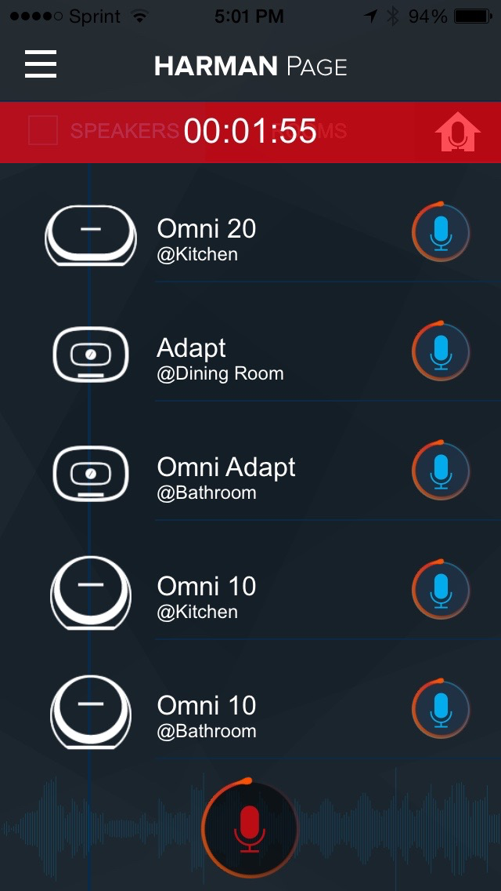
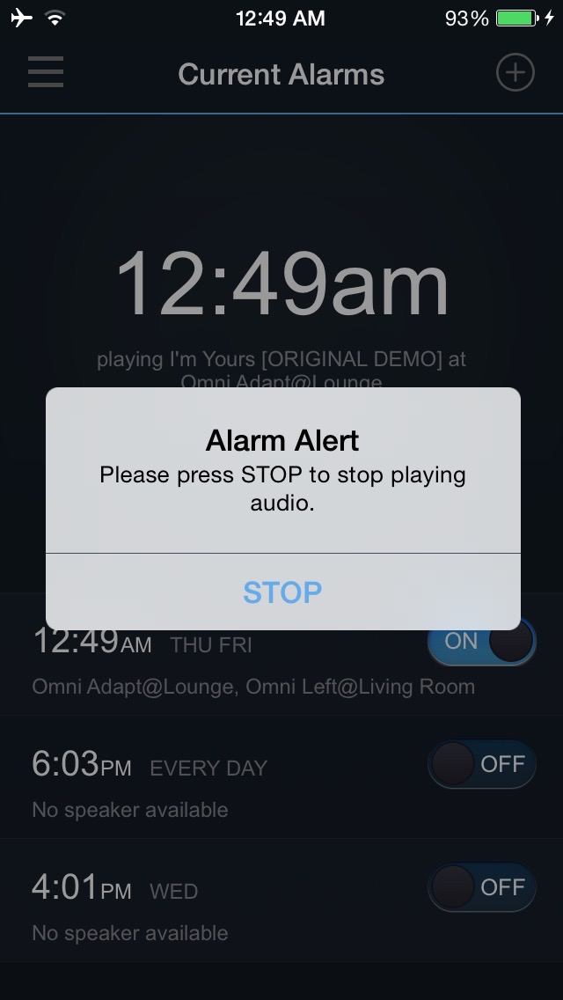
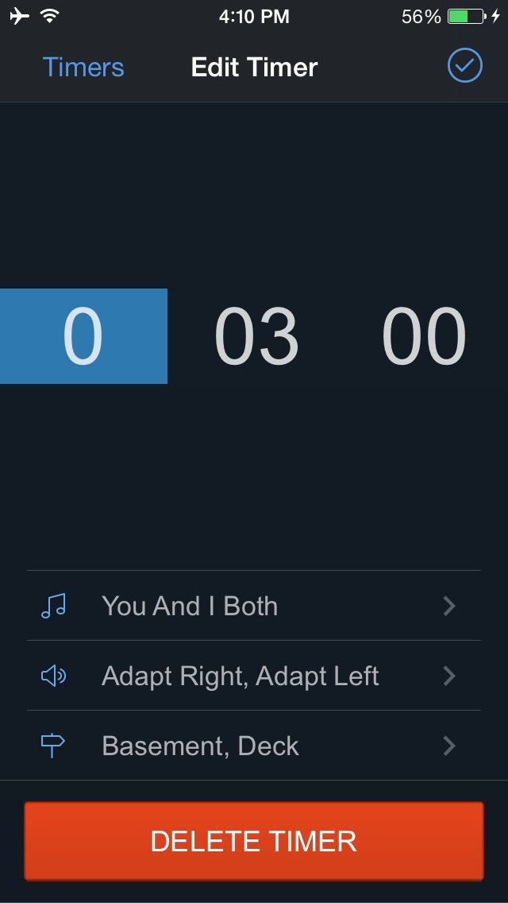
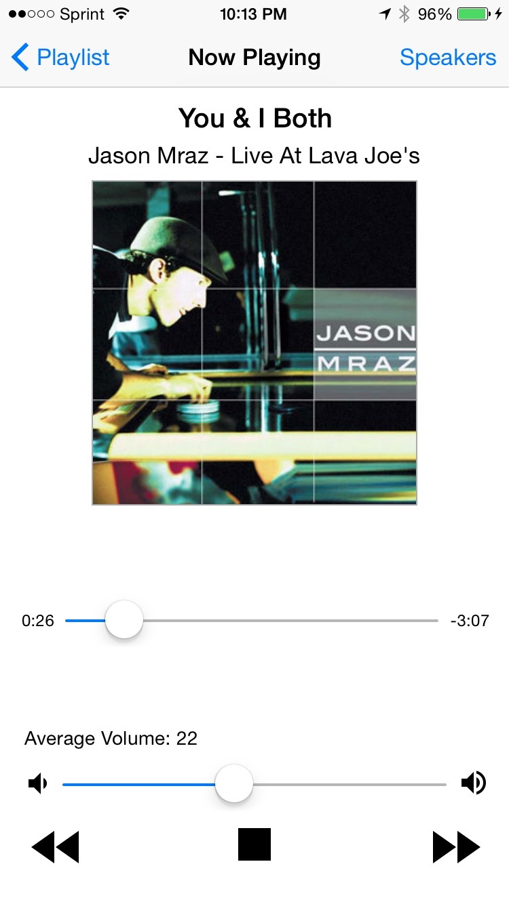
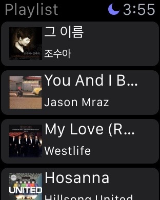
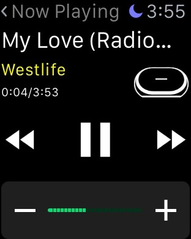
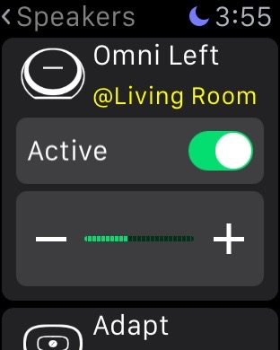

Overview of HKWirelessHD SDK (iOS)
==================================

The Harman Kardon WirelessHD (HKWirelessHD) SDK is provided for iOS 3rd party developers to communicate with Harman/Kardon Omni Series audio/video devices. The intent of this SDK is to provide the tools and libraries necessary to build, test and deploy the latest audio applications on the iOS platform.

What's Included
---------------

- HKWirelessHD library and header files
	- We provide two versions of SDK - a normal version and a lightweight version. See below for the information.
	- The reason we support the SDK as two separate version is that we know that many developers want a feature of web streaming. To support this feature, we need to include a version of FFMPEG library inside of the SDK library. But, some developers may want to use their own version of MMPEG to handle audio stream for some particular reasons. We describe more about these two versions in the `Getting Started (iOS)`_.

- License Agreement. Located within the root directory of the zip file.
- This Document. Located in the HKWirelessHDSDK.zip (HKWirelessHDSDK/doc folder). There are two more documents available for developers.
	- HKWHD SDK Programming Guide (available in HKWirelessHDSDK/doc folder)
	- HKWHD SDK Apple Watch App Programing Guide (coming soon)
- Sample Application source code Located within the Sample Apps page:
	- Page App
	- Wake App
	- Timer App
	- HKWPlayer App with Apple Watch app support
	- HKWHub App

.. _Getting Started (iOS): getting-started-iOS.html

Requirements
------------

The HKWirelessHD SDK requires the lastest iOS (8.4 as of writing this) for iPhone or iPad devices.
Xcode 6.4 (supporting iOS8.4) or later is required for building HKWirelessHD enabled iOS apps with Apple Watch app support.

  
Demo Applications
-----------------

HK Page app
~~~~~~~~~~~

The Page app records user’s voice and broadcasts it to a set of selected speakers in the network. User can select speakers individually or select rooms. The Page app also contain House Alert feature that broadcast an alarm sound like siren to all of the speakers in the network.

The application also has a feature for changing the speaker information, like speaker name, group name, taking a note, and so on.

.. figure:: img/sdk-overview/page-app-2.png
	:scale: 40
.. figure:: img/sdk-overview/page-app-3.png
	:scale: 40
	
HK Wake app
~~~~~~~~~~~

Wake app is a kind of Alarm clock. Instead of playing an alarm sound on your phone, the app play a song over the Omni speakers in the network. User can select a set of individual speakers or room to play the alarm sound with.

.. figure:: img/sdk-overview/wake-app-1.png
	:scale: 40
.. figure:: img/sdk-overview/wake-app-2.png
	:scale: 40

	
HK Time app
~~~~~~~~~~~

Time (Timer) app is a kind of timer app. Instead of playing a beep sound on your phone, the app plays a predefined song over the Omni speakers in the network. User can select a set of individual speakers or room to play the alarm sound with.

.. figure:: img/sdk-overview/time-app-1.png
	:scale: 40

.. figure:: img/sdk-overview/time-app-3.png
	:scale: 40
	
HKWPlayer app with Apple Watch support
~~~~~~~~~~~~~~~~~~~~~~~~~~~~~~~~~~~~~~

HKWPlayer is a sample music player app that plays MP3 audio files with Omni speakers wirelessly. You can create and manage a playlist of MP3 titles from iOS Music app library, and play songs over the Omni speakers in the network. The purpose of the app is to demonstrate the key features of the HKWirelessHD SDK.

.. figure:: img/sdk-overview/hkwplayer-app-1.png
	:scale: 40

.. figure:: img/sdk-overview/hkwplayer-app-3.png
	:scale: 40

HKWPlayer app also support Apple Watch app. If user installs the HKWPlayer app on the iPhone and enable "Show App on Apple Watch" option in Apple Watch app, then the corresponding watch app will appear in the menu screen of Apple Watch.

The companion watch app is provided as Watch App Extension within a single iOS App package. The Watch app extension communicates with the main iOS app (e.g. HKWPlayer app) for control command and response, and share the playlist and the device status for rendering the menu.

The implementation note for Watch App support will be available at the developer community web site shortly.

