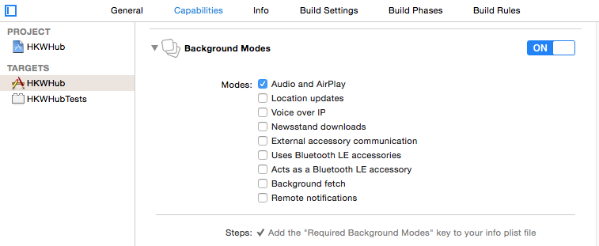

Troubleshooting
====================

Handling of link error “undefined symbols for architecture armv7”
------------------------------------------------------------------

HKWirelessHD SDK uses C++ codes, so the linker should include std c++ library. To prevent this kinf od link error, your project setting should include “-lstdc++” in Targets > Build Settings > Linking > Other Linker Flags field.

Unspecified linking parameter is added in link command
--------------------------------------------------------

If you encounter unspecified linking parameter such as library names, etc., there is possibility that Xcode is using cached build parameters that were used before. In this case, just delete “Xcode/DerivedData” folder in your ~/Library/Developer folder. That is, 

.. code-block:: swift

	$ cd ~/Library/Developer/Xcode/DerivedData/
	$ rm -rf [your-project-name]*

Playback stops when the app turns to background mode
-----------------------------------------------------

When an app playing music using HKWirelessHDSDK may stop playing when the app becomes background. It is because iOS stops all on-going network communication when the app is backgrounded. There are several expcetional cases that iOS allows even in background mode. Please refer to `iOS Developer Library`_ for more information on background execution.

.. _iOS Developer Library: https://developer.apple.com/library/ios/documentation/iPhone/Conceptual/iPhoneOSProgrammingGuide/BackgroundExecution/BackgroundExecution.html

To prevent our HKWirelessHD apps from stopping in background mode, we can do a trick based on iOS Audio background mode. For our sample apps not to be stopped during the background mode, we use `MMPDeepSleepPreventer`_. The idea of MMPDeepSleepPreventer is to play zero length of silent audio every 5 seconds by enabling iOS Audio background mode. 

.. _MMPDeepSleepPreventer: https://github.com/marcop/MMPDeepSleepPreventer

To enable iOS Audio background mode, you need to enable it in Project setting. 

- Go to Project > Targets > Capabilities > Background Modes
- Turn on the option of  **Audio and AirPlay**

Then, just initialize and start DeepSleepPreventer in ``AppDeleget.application:didFinishedLaunchingWithOption()`` as follows:

.. code-block:: swift

	func application(application: UIApplication, didFinishLaunchingWithOptions launchOptions: [NSObject: AnyObject]?) -> Bool {

		// prevent from turning into background
		sleepPreventer = MMPDeepSleepPreventer()
		sleepPreventer.startPreventSleep()

You can stop the sleep preventer when the app becomes foregrounded (``applicationWillEnterForeground()``), and start it again just before the app becomes backgrounded (``applicationWillResignActive()``).

	
